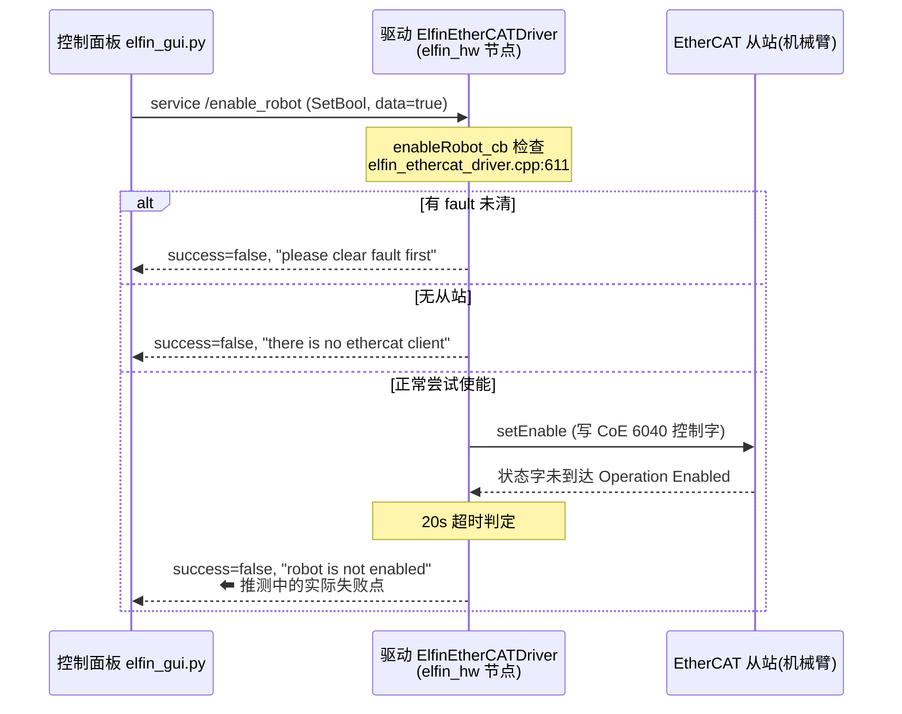
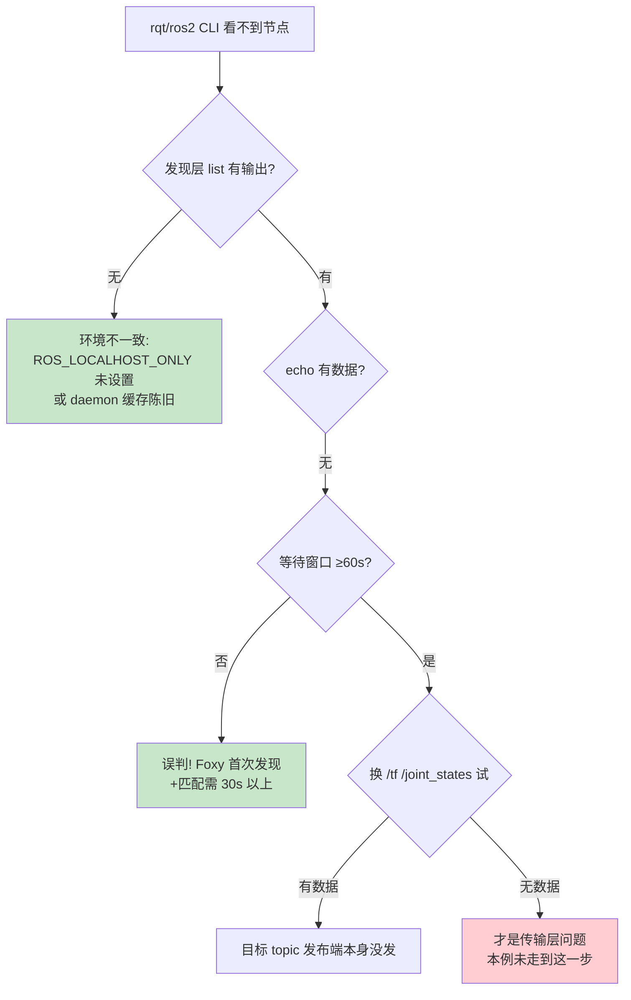
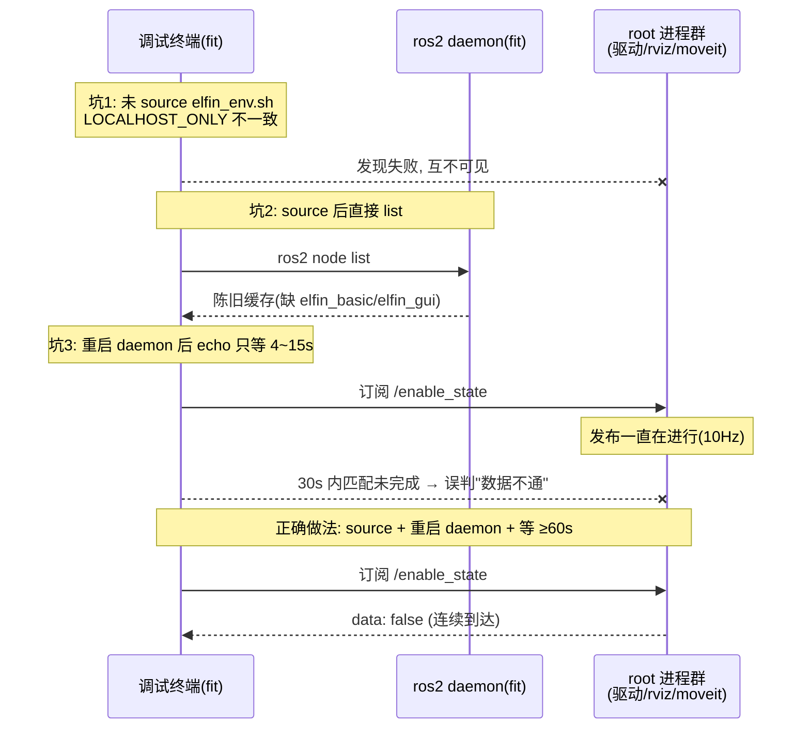

# Elfin 面板与驱动通信调查 — 推测记录

> [!abstract] 背景
> 实机测试时面板 Servo On 失败(喀哒一声就停), 且普通用户下 rqt 看不到任何 node/topic/service。
> 本文记录调查过程中提出的推测、推测依据和最终判定(✅ 证实 / ❌ 证伪 / ❓ 待查)。
> 证据明细见 [[排查证据-面板与驱动通信调查]], 每条推测末尾有对应证据锚点。

### 推测 1: 删除多余机型包后残留引用导致启动失败 ✅ 证实(已修复)

**原因**: 删除了 elfin3/10/10_l/15/5_l 的 gazebo+moveit2 包, 但 `elfin_basic_api.launch.py` 硬编码引用 `elfin10_ros2_gazebo` / `elfin10_ros2_moveit2` 的 URDF/SRDF/kinematics, `start_sim.py` / `start_real.py` 菜单仍保留被删机型条目, `install/` 有旧产物。这些与 Servo On 失败无直接因果, 但会污染排查现场。

**处置**: 删除旧 launch、清理两个脚本、全量重建(10 包编译通过)。

> 证据: [[排查证据-面板与驱动通信调查#证据 1: 机型包删除后的残留引用]]

### 推测 2: Servo On 失败是 ROS 通信链路中断 ❌ 证伪

**原因**: 面板 → `/enable_robot` service → 驱动 `enableRobot_cb` 这条链路如果断了, service call 会超时或无响应。实测 service 跨用户调用正常应答, response.message 能完整返回, 链路是通的。
因此失败点在链路末端: 驱动判定 `getFaultState()==true` 拒绝使能, 或使能过程中 EtherCAT/供电/抱闸层掉链子(喀哒声 = 抱闸/继电器吸合后立刻释放)。



> 证据: [[排查证据-面板与驱动通信调查#证据 4: elfin 服务全部在线(发现层)]] / [[排查证据-面板与驱动通信调查#证据 8: 跨用户 service 调用成功]] / [[排查证据-面板与驱动通信调查#证据 11: 源码层依据(文件与行号)]]

### 推测 3: rqt 看不到节点是 sudo 跨用户的 DDS 共享内存(SHM)权限问题 ⚠️ 2026-09-19 重新证实

> [!warning] 更正(2026-09-19): 原「❌ 证伪」判定不成立, 本推测**成立**, 且是根本原因
> 用两个自建 rclpy 节点(`scripts/dds_discovery_probe.py`)在多个**干净 domain** 上重做对照实验:
> **root 与 fit 的参与者无法互相发现**, 与 `ROS_LOCALHOST_ONLY`、umask、domain 是否干净
> **均无关**; 而同 uid(fit+fit)在同样条件下可以互发现。完整矩阵见
> [[排查证据-面板与驱动通信调查#证据 13: root↔fit 跨用户 DDS 发现失败(2026-09-19 重测)]]。
>
> **机理**: 同机通信默认走 Fast-DDS 共享内存(SHM), 而 SHM 段**跨 uid 打不开**;
> `ROS_LOCALHOST_ONLY=1` 又把组播限制在回环, 可本机 `lo` 网卡**没有 `MULTICAST` 标志**,
> 组播实际走 `enx000ec68eca09`, 回环收不到 —— **没有任何回退通路**, 于是彻底发现不了。
> 由此得出硬约束: **实机上所有 ROS 进程必须同一 uid**。
>
> **原「证伪」错在哪**: 当时只验证了"某次现场 fit 侧能收到 root 的数据", 单次成功
> 不足以否定一个**条件性**结论; 且那次的网络现场(默认路由网卡、`lo` 组播、
> tailscale0 是否存在)与今天不同。判定跨用户通信能力必须按 **uid 组合**做对照实验。

**原因(原推理, 成立)**: 现场进程全部是 root, `/dev/shm/fastrtps_*` 段属主 root 权限 644, Fast DDS 同机通信默认优先 SHM, fit 侧挂不上 —— 表现为发现层直接**互不可见**。

**原「证伪过程」(保留历史记录, 结论已推翻)**: 曾用控制变量逐层测试, 观察到 fit 用户能收到 root 发布的 `/tf`、`/joint_states`、`/enable_state`, 能调用 root 的 service, 据此判定"跨用户数据面完全正常, SHM 没有成为障碍"。



> ⚠️ 上图是**当时**的判断流程, 其结论已被上面的更正推翻: 真正的分叉是"两侧 uid 是否相同",
> 而不是"发现层有没有输出"。判据修正为: `ps -eo user,comm | grep -E 'ros2|rviz|move_group'`
> 看节点属主, 再确认调试终端与节点**同 uid**。

> 证据: [[排查证据-面板与驱动通信调查#证据 5: 跨用户话题(tf)数据到达(⚠️ 单次观测, 已被证据 13 推翻)]] / [[排查证据-面板与驱动通信调查#证据 6: joint_states 约 50Hz 且时间戳抖动]] / [[排查证据-面板与驱动通信调查#证据 9: QoS 与发布者归属]] / [[排查证据-面板与驱动通信调查#证据 13: root↔fit 跨用户 DDS 发现失败(2026-09-19 重测)]]

### 推测 4: "看不到"的真实原因是环境/缓存/时间窗口三重叠加 ✅ 证实

**原因**:
1. **环境**: rqt 前没 source, `ROS_LOCALHOST_ONLY` 与启动脚本不一致 → 发现层直接失败;
2. **缓存**: `ros2 node list` 走 daemon(属主 fit, 独立于 root 进程)缓存, 现场变化后陈旧 → 名单不可信;
3. **窗口**: 本机多网卡(enp2s0 混杂模式跑 EtherCAT + tailscale0)且负载高, 首次发现 + 端点匹配要 30s 以上, 短窗口 echo 必然为空 → 误判"数据不通"。



> [!warning] 补充(2026-09-19): 本推测的三个因素是**次要**因素, 不是根本原因
> 未 source / daemon 缓存陈旧 / 发现窗口太短 确实会造成误判, 排查时仍应照做;
> 但只要节点以 root 跑, fit 侧**无论怎么 source、怎么重启 daemon、等多久都看不到** ——
> 根本原因是 [[#推测 3: rqt 看不到节点是 sudo 跨用户的 DDS 共享内存(SHM)权限问题 ⚠️ 2026-09-19 重新证实]] 的 uid 隔离。
> 判据: 先比 uid, 再谈缓存与窗口。

> 证据: [[排查证据-面板与驱动通信调查#证据 3: ros2 daemon 缓存陈旧]] / [[排查证据-面板与驱动通信调查#证据 7: enable_state 长窗口(60s 以上)后到达]] / [[排查证据-面板与驱动通信调查#证据 10: 本机网络与 DNS 环境]] / [[排查证据-面板与驱动通信调查#证据 12: 测试过程中的干扰项与修正记录]]

### 推测 5: /enable_state 无数据是驱动 status_timer 未被 spin ❌ 证伪

**原因(当时的推理)**: 驱动节点 `elfin_hw` 没有独立 executor, 只靠 `read()` 里的 `rclcpp::spin_some(n_)` 泵动(`elfin_hardware_interface.cpp:280`); 若控制循环停了, 100ms 的 `status_timer_` 就不触发。
**证伪**: 延长窗口后 `/enable_state` 连续到达 `data: false`。timer 正常, 之前是推测 4 的窗口问题。

> 证据: [[排查证据-面板与驱动通信调查#证据 7: enable_state 长窗口(60s 以上)后到达]] / [[排查证据-面板与驱动通信调查#证据 11: 源码层依据(文件与行号)]]

### 推测 6: /joint_states 时间戳抖动是控制循环被间歇阻塞 ❓ 待查

**原因**: 实测 `/joint_states` 名义 ~50Hz 但相邻帧间隔在 20ms~300ms 间抖动。候选原因:
- 机器整体负载高(4 组 ROS 进程 + EtherCAT 实时循环抢 CPU);
- `read()` 里 `spin_some` 与 PDO 读写互锁, service 调用(如面板轮询 IO)会拉长控制周期;
- 非 PREEMPT_RT 内核或 `chrt 10` 优先级未真正生效。
抖动可能影响轨迹执行平滑度, 与 Servo On 失败的因果关系**未建立**, 列入仿真 debug 观察项。

> 证据: [[排查证据-面板与驱动通信调查#证据 6: joint_states 约 50Hz 且时间戳抖动]]

### 推测关系总览

```mermaid
flowchart LR
    S[Servo On 失败<br/>喀哒一声就停] --> S1[推测2: ROS链路断 ❌]
    S --> S2[故障未清/使能超时<br/>硬件层原因 ⬅ 当前主方向]
    R[rqt 看不到节点] --> R1[推测3: sudo/SHM 跨 uid<br/>⚠️ 成立<br/>= 根本原因]
    R --> R2[推测4: 环境+缓存+窗口<br/>✅ 次要(会加剧误判)]
    R1 -.处置.-> R3[统一 uid:<br/>全 root(现状) 或 全 fit(setcap)]
    style R1 fill:#ffcdd2
    style R2 fill:#fff9c4
    style R3 fill:#c8e6c9
    S1 -.排除后聚焦.-> S2
    R2 -.产出.-> DOC[排查手册 + root_ros.sh<br/>+ elfin_env.sh]
    J[joint_states 抖动 ❓] -.-> SIM[后续 Gazebo 仿真验证]
```

> [!note] 相关文档
> - [[排查证据-面板与驱动通信调查]] — 本文全部推测的证据、命令、文件
> - [[ROS2运行状态排查手册]] — 排查命令速查与方法论
