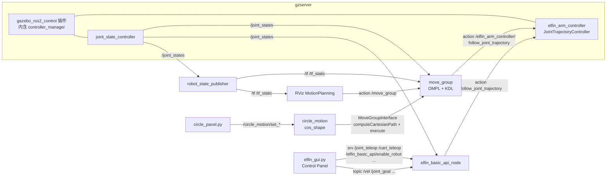
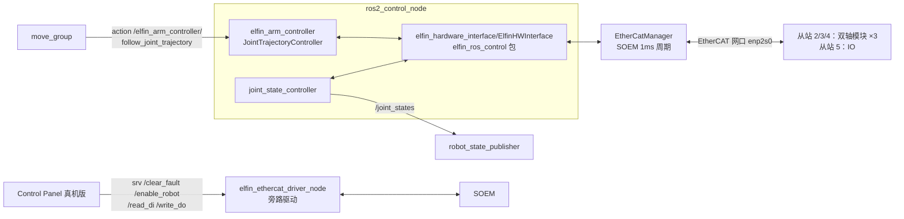

# Elfin5 工作区架构与数据流

> 环境：Ubuntu 20.04 + ROS2 **Foxy** + Gazebo 11 + MoveIt2 2.2.3（Docker 容器）
> 工作空间：`~/ws_ros2/cos_ws/elfin_ws`（colcon），源码在 `elfin_ws/src/`
> 相关问题清单见 [[已知问题]]

## 总览

仓库分四块：

| 区域 | 内容 | 是否进 ROS |
|---|---|---|
| `elfin_ws/src/elfin_robot/` | 华沿官方 ROS2 包（仿真 + 实机驱动，共 10 个包） | 是 |
| `elfin_ws/src/cos_shape/` | 自研应用包（末端轨迹形状演示） | 是 |
| `scripts/` | 启动/构建/等待脚本，`legacy/` 为实机时代归档 | 否 |
| `windows_sdk/`、`document/` | Windows 侧 C++ SDK（TCP 直连控制柜）、官方文档 | 否 |

---

## 包（package）

#### elfin_description

URDF / meshes 包，6 个机型（elfin3/5/5_l/10/10_l/15）各一份独立 xacro。

##### 节点
- 无自有节点。`launch/display.launch.py` 仅用于单独查看模型（joint_state_publisher_gui + robot_state_publisher + rviz）。

##### 消息
- 无。只通过 `robot_description` 参数向外提供模型。

##### 关键命名（全机型一致）
- 关节：`elfin_joint1` … `elfin_joint6`（revolute，限速 1.57 rad/s）
- 连杆链：`world` → `elfin_base_link` → `elfin_base` → `elfin_link1..6` → `elfin_end_link`（末端）
- 注意：本包的 `.gazebo` 插件标签是 ROS1 遗物，**实际生效的 ros2_control 标签在 `elfin5_ros2_gazebo/urdf/elfin5_gazebo.xacro`**。

#### elfin_robot_msgs

纯接口包，只有 5 个 `.srv`，无 `.msg` / `.action`。

| srv | 字段 | 谁用 |
|---|---|---|
| `ElfinIODRead.srv` | req `bool data` → resp `int32 digital_input` | 服务端 `elfin_ethercat_driver`（`read_di`/`read_do`），客户端 GUI |
| `ElfinIODWrite.srv` | req `int32 digital_output` → resp `bool success` | 服务端 driver（`write_do`），客户端 GUI |
| `SetInt16.srv` | req `int16 data` | `elfin_basic_api` 的 `joint_teleop`/`cart_teleop` |
| `SetString.srv` | req `string data` | `elfin_basic_api` 的 `set_reference_link`/`set_end_link` |
| `SetFloat64.srv` | req `float64 data` | 声明了但未实际创建服务（速度缩放走 `/vel` topic） |

#### elfin5_ros2_gazebo

Gazebo 仿真包：world、仿真 xacro（含 ros2_control 标签）、控制器 yaml。

##### 节点
- 无自有节点。`launch/elfin5_gazebo.launch.py` 起 gzserver/gzclient + robot_state_publisher + spawn_entity。
- ⚠ 单独启动它**不会加载控制器**（launch 里的 load_start_controller 是死代码），仿真请走 `elfin5_ros2_moveit2 elfin5.launch.py`。

##### 消息
- 无自有 topic。ros2_control 配置在 `config/elfin_arm_controller.yaml`：
  - `elfin_arm_controller`：`joint_trajectory_controller/JointTrajectoryController`（position 接口，6 关节）
  - `joint_state_controller`：`joint_state_controller/JointStateController`（发 `/joint_states`）
  - `controller_manager.update_rate: 50`

##### Gazebo 插件
- `libgazebo_ros2_control.so`（`urdf/elfin5_gazebo.xacro`），在 gzserver 进程内创建 controller_manager。
- xacro 三态开关：`use_fake_hardware` → `fake_components/GenericSystem`；`use_real_hardware` → `elfin_hardware_interface/ElfinHWInterface`（真机，见 [[已知问题]]）；都为 false → `gazebo_ros2_control/GazeboSystem`（仿真）。

#### elfin5_ros2_moveit2

MoveIt2 配置与 launch 包（规划管线 OMPL，运动学 KDL）。

##### 节点（由 launch 启动）
| Launch | 启动内容 | 用途 |
|---|---|---|
| `elfin5.launch.py` | Gazebo + spawn + static_tf(world→elfin_base_link) + robot_state_publisher + 2 个 spawner + **move_group** + RViz | **仿真主入口** |
| `elfin5_moveit.launch.py` | static_tf + robot_state_publisher + **ros2_control_node**（真机硬件侧） | 真机第 1 步 |
| `elfin5_moveit_rviz.launch.py` | **move_group** + RViz + 2 个 spawner | 真机第 2 步 |
| `elfin5_basic_api.launch.py` | `elfin_basic_api/elfin_basic_api_node` | 仿真/真机通用第 3 步 |

##### 消息
- move_group 标准 topic：`/display_planned_path`、`/monitored_planning_scene`、`/planning_scene` → RViz
- 控制器 action：**`/elfin_arm_controller/follow_joint_trajectory`**（`control_msgs/action/FollowJointTrajectory`，`config/elfin_controllers.yaml`）
- `/elfin_arm_controller/joint_trajectory`、`/elfin_arm_controller/state`（JTC 标准接口）

##### 关键配置
- `config/elfin5.srdf`：规划组 `elfin_arm`（6 关节 + `elfin_end_link`）、`elfin_end_group`；named states `home`（全 0）、`test`
- `config/kinematics.yaml`：`kdl_kinematics_plugin/KDLKinematicsPlugin`，timeout 0.05
- `config/ompl_planning.yaml`：RRTConnect 等 24 种 planner；`chomp_planning.yaml` 存在但未被加载
- 控制器管理器：`moveit_simple_controller_manager/MoveItSimpleControllerManager`

#### elfin_basic_api

后台 API 节点 + Elfin Control Panel GUI（wxPython）。

##### 节点
| 可执行 | 节点名 | 说明 |
|---|---|---|
| `elfin_basic_api_node` | 内部两个节点：`elfin_basic_api_node_base`（MoveGroupInterface 宿主）+ `base_api_node` | 由 `elfin5_basic_api.launch.py` 启动 |
| `scripts/elfin_gui.py` | `elfin_gui_node` | "Elfin Control Panel" 窗口；`fake_elfin_gui.launch.py`（仿真）/ `elfin_gui.launch.py`（真机） |
| `scripts/test.py` | — | 向 `/joint_goal` 等发测试指令 |

##### 消息（topic）
订阅：`/joint_goal`（JointState）、`/cart_goal`（PoseStamped）、`/cart_path_goal`（PoseArray）、`/vel`（Float32 速度缩放）、`/elfin_teleop_joint_cmd_no_limit`（Int64）、`/joint_states`
发布：`/reference_link_name`、`/end_link_name`（String）、`/desired_torques`（Float64MultiArray）、`/elfin_basic_api/publish_planning_scene`

##### 服务（server）
`/set_reference_link`、`/set_end_link`（SetString）；`/elfin_basic_api/enable_robot`、`/elfin_basic_api/disable_robot`、`/home_teleop`、`/stop_teleop`、`/get_reference_link`、`/get_end_link`（SetBool）；`/joint_teleop`、`/cart_teleop`（SetInt16）

##### 对外调用（client）
- Action：`/elfin_arm_controller/follow_joint_trajectory`
- Service：`/controller_manager/switch_controller`、`/controller_manager/list_controllers`、`/enable_robot`、`/disable_robot`、`/get_motion_state`、`/get_pos_align_state`（后四个真机驱动提供）

#### cos_shape（自研）

末端轨迹形状演示，当前实现圆周运动（`elfin_end_link` 绕指定圆心、保姿态画圆）。

##### 节点
| 节点 | 说明 |
|---|---|
| `circle_motion`（C++） | computeCartesianPath 生成整圈轨迹 → 时间参数化缩放到目标周期 → `mgi.execute()` 逐圈循环；连续 5 圈失败自动停 |
| `circle_panel.py`（wxPython） | 调参面板，发布下列 `~/set_*` topic |

Launch：`launch/circle_motion.launch.py`（手动喂 URDF + SRDF 参数；运行前提是仿真已启动）。

##### 消息
全部在命名空间 `/circle_motion/` 下：

| Topic | 方向 | 类型 | 作用 |
|---|---|---|---|
| `enable` | 订阅 | Bool | 开始/停止 |
| `set_center` | 订阅 | Point | 圆心，下一圈生效 |
| `set_radius` | 订阅 | Float64 | 半径（m） |
| `set_angular_velocity` / `set_linear_velocity` | 订阅 | Float64 | 角速度(rad/s)/线速度(m/s)，二选一切换模式 |
| `set_inclination` / `set_azimuth` | 订阅 | Float64 | 圆平面倾角/方位角（rad） |
| `state` | 发布 | String | 每圈结束的状态摘要 |

无自有 service/action；通过 MoveGroupInterface 间接使用 move_group。

#### soem_ros2

SOEM（Simple Open EtherCAT Master v1.4.0）的打包封装：编译为静态库 `libsoem` 导出，无节点、无 topic。消费者是 `elfin_ethercat_driver`。

#### elfin_ros_control

ros2_control 硬件接口插件（实机），pluginlib 导出两个 `hardware_interface::SystemInterface` 实现（`elfin_hardware_interface.xml`）：

- `elfin_hardware_interface/ElfinHWInterface` —— 完整版（xacro `use_real_hardware:=true` 时引用）
- `elfin_hardware_interface/ElfinHWInterface_PositoinOnly` —— 仅位置接口版（注意类名原文拼写如此）

内部实例化 `ElfinEtherCATDriver`/`EtherCatManager`，`read()/write()` 做编码器计数 ↔ 弧度换算后走 SOEM。无节点、无自有 topic（经 controller_manager 间接暴露 `/joint_states` 与 JTC action）。

#### elfin_ethercat_driver

EtherCAT 主站驱动（实机）。`EtherCatManager` 直接调 SOEM C API，1ms 周期线程收发 PDO；聚合 3 个模块从站 client（每从站 2 轴）+ 1 个 IO 从站 client。

##### 节点
- 可执行 `elfin_ethercat_driver`，节点名 `elfin_ethercat_driver_node`（launch 覆盖）。由 `elfin_robot_bringup/launch/elfin_ros2_ethercat.launch.py` 启动。

##### 消息
- 发布：`/enable_state`、`/fault_state`（Bool，100ms）
- ⚠ 不是 ros2_control hardware interface，无 `elfin_arm_write/read` 话题（ROS1 接口已废弃）

##### 服务（server，均 SetBool 除 IO 外）
`/enable_robot`、`/disable_robot`、`/clear_fault`、`/recognize_position`、`/get_motion_state`、`/get_pos_align_state`、`/get_current_position`、`/get_txpdo`、`/get_rxpdo`；每模块从站 `elfin_module_enable/reset_fault/open_brake/close_brake_slave<N>`；IO 从站 `/read_di`、`/read_do`（ElfinIODRead）、`/write_do`（ElfinIODWrite）

#### elfin_robot_bringup

实机参数 + 驱动 launch。

- `launch/elfin_ros2_ethercat.launch.py`：只起 ethercat 驱动节点（参数 `config/elfin_drivers.yaml`）
- `config/elfin_drivers.yaml`：网卡 `enp2s0`、从站 `[2,3,4]`、`count_zeros`（逐机标定）、`axis_position/torque_factors`
- `config/elfin_arm_control.yaml`：同上驱动参数 + controller_manager/JTC 配置（被真机 `ros2_control_node` 加载）
- ⚠ 关节顺序约定 **[J2,J1,J3,J4,J5,J6]**（yaml 注释）；`calib_zero.py` 用于标定 `count_zeros`

---

## 启动命令

#### 仿真（Gazebo + MoveIt2 一体）

##### 启动moveit2
```bash
source ~/ws_ros2/cos_ws/elfin_ws/install/setup.bash
ros2 launch elfin5_ros2_moveit2 elfin5.launch.py
```
一条命令拉起 Gazebo + ros2_control 控制器 + move_group + RViz。

##### 启动后台 basic_api（Control Panel 的后端）
```bash
ros2 launch elfin5_ros2_moveit2 elfin5_basic_api.launch.py
```

##### 启动 Control Panel GUI（仿真 fake 版）
```bash
ros2 launch elfin_basic_api fake_elfin_gui.launch.py
```

##### 启动圆周运动演示（自研）
```bash
ros2 launch cos_shape circle_motion.launch.py     # 另开终端
ros2 run cos_shape circle_panel.py                # 调参面板（可选）
```

##### 一键脚本
```bash
~/ws_ros2/cos_ws/scripts/start_sim.sh          # moveit2（容器内自动后台，日志 elfin_ws/log/sim/）
~/ws_ros2/cos_ws/scripts/start_sim.sh gazebo   # 再起 Control Panel
~/ws_ros2/cos_ws/scripts/start_sim.sh stop     # 停止
```
注意：`start_sim.sh` 不起 basic_api；`start_sim.py` 起全部 3 个但需要 gnome-terminal。

#### 真机（EtherCAT，需 PREEMPT_RT 内核）

严格按顺序开 4 个终端（等价于一键脚本 `scripts/start_real.py`；`scripts/legacy/` 下是历史存档, 勿用）：

> [!danger] 这 4 个终端**必须同一身份**
> 实测 root 与 fit 的 DDS 参与者互不可见（[[已知问题]] #22），所以 2/3/4 号**不能**换成普通用户,
> 否则 spawner↔controller_manager 直接断链。调试 rqt 也需同身份: `scripts/root_ros.sh rqt`。

##### 1. 硬件驱动 + ros2_control（实时优先级）
```bash
sudo chrt 10 bash
source ~/ws_ros2/cos_ws/elfin_ws/install/setup.bash
ros2 launch elfin5_ros2_moveit2 elfin5_moveit.launch.py
```

##### 2. MoveIt + RViz（等 `/controller_manager/list_controllers` 就绪后）
```bash
ros2 launch elfin5_ros2_moveit2 elfin5_moveit_rviz.launch.py
```

##### 3. 后台 basic_api（等 `move_group` 节点就绪后）
```bash
ros2 launch elfin5_ros2_moveit2 elfin5_basic_api.launch.py
```

##### 4. Control Panel GUI（真机版，等 `/get_reference_link` 就绪后）
```bash
ros2 launch elfin_basic_api elfin_gui.launch.py
```
使能流程：Control Panel 先 **Clear Fault** 再 **Servo On**；断电前先 **Servo Off**。

##### 旁路：仅驱动层（不走 MoveIt，做使能/IO/诊断）
```bash
ros2 launch elfin_robot_bringup elfin_ros2_ethercat.launch.py
```

> ℹ 真机链路的 ros2_control 硬件插件由 `elfin_ros_control` 包提供（已在本工作区，编译通过，待真机验证），见 [[已知问题]] 第 1 条。

---

## 数据流

### 仿真链路



链路要点：`elfin5.launch.py` 里 Gazebo 插件在 gzserver 内创建 controller_manager（因此不能再起独立 `ros2_control_node`）；spawner 加载两个控制器后，move_group 经 `moveit_simple_controller_manager` 把轨迹发向 JTC 的 FollowJointTrajectory action；JTC 插值写 position command interface，由 GazeboSystem 应用到仿真关节，状态经 `/joint_states`（100Hz）回流。

### 真机链路



链路要点：与仿真的差别只在最底层——`gazebo_ros2_control/GazeboSystem` 换成 `elfin_hardware_interface/ElfinHWInterface`（xacro `use_real_hardware:=true`），插件内部实例化 `ElfinEtherCATDriver`/`EtherCatManager`，`read()/write()` 做编码器计数 ↔ 弧度换算（`count_rad_factors = reduction_ratios × axis_position_factors / 2π`），经 SOEM 走 `enp2s0` 到从站。Control Panel 的使能/清错/IO 不经过 ros2_control，直接调驱动节点的服务。

---

## MoveIt2 / ros2_control 接口速查

| 接口 | 全名 | 类型 | 提供方 |
|---|---|---|---|
| Action | `/elfin_arm_controller/follow_joint_trajectory` | `control_msgs/action/FollowJointTrajectory` | JTC（ros2_control） |
| Action | `/move_group`、`/execute_trajectory` | `moveit_msgs/action/*` | move_group |
| Service | `/plan_kinematic_path`、`/compute_cartesian_path`、`/get_planning_scene` … | moveit 标准 | move_group |
| Service | `/controller_manager/switch_controller`、`/list_controllers` | `controller_manager_msgs` | controller_manager |
| Topic | `/joint_states` | `sensor_msgs/JointState` | joint_state_controller |
| Topic | `/tf`、`/tf_static` | `tf2_msgs/TFMessage` | robot_state_publisher + static_tf |
| 规划组 | `elfin_arm`（6 关节）、`elfin_end_group` | SRDF | elfin5.srdf |
| 控制器 | `elfin_arm_controller`（JTC）、`joint_state_controller` | ros2_control | gzserver 插件 / ros2_control_node |
